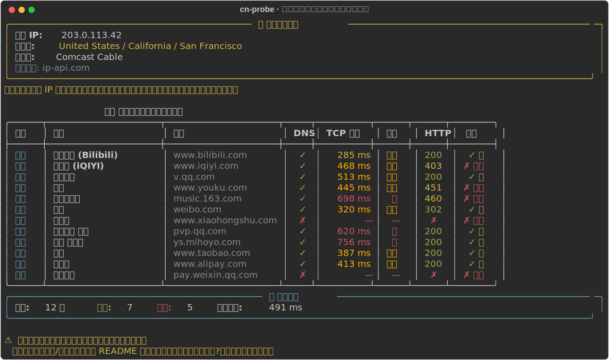
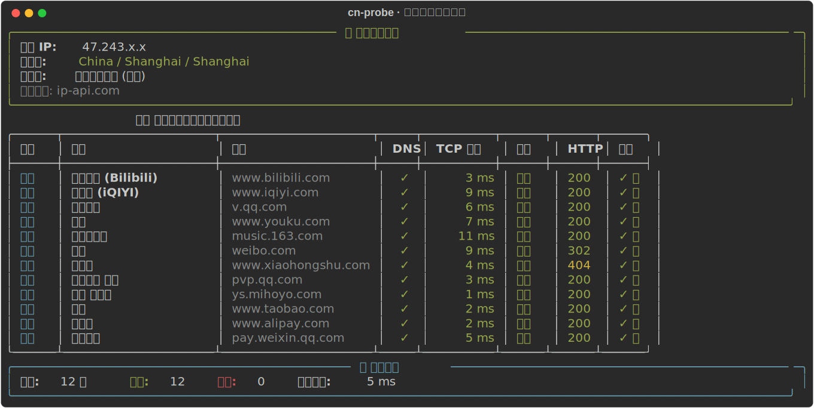

# china-network-probe · 海外回国网络访问检测工具

> 中文 · [English](README.en.md)

> 一个命令行工具，用来检测**当前网络环境**访问中国大陆主流互联网服务（视频、音乐、社交、国服游戏、支付、电商）的**延迟、可达性、DNS 解析、出口 IP 归属地**。

[](https://opensource.org/licenses/MIT)
[](https://www.python.org/downloads/)
[]()

<p align="center">
  💎 本项目由 <a href="https://www.speedx.link/"><b>SpeedX</b></a> 赞助支持 · 海外华人和留学生回国加速服务（影音 / 国服游戏 / 社交全场景优化）
</p>

## 一眼看懂能干嘛

**海外直连国内服务 — 延迟高、部分被地区限制：**



**使用回国加速器后 — 全部低延迟可达：**



> 工具用真实的 **DNS / TCP / HTTP** 数据告诉你：现在的网络访问 B站、爱奇艺、网易云、王者荣耀国服、微信支付，到底哪里出了问题、加速器有没有真的生效。

---

**适用场景：**

- 🌏 海外华人、留学生想知道当前网络访问国内 App / 网站的状态如何
- 🎮 国服游戏（王者荣耀、原神、LOL 国服）延迟高，需要定位问题
- 📺 海外访问 B站、爱奇艺、腾讯视频、优酷、芒果TV 加载缓慢或被地区限制
- 🎵 网易云音乐、QQ音乐 在海外显示「该地区不可用」
- 💬 海外使用微信、支付宝、淘宝、京东 卡顿
- 🚀 已经用了**回国 VPN / 回国加速器**，想客观验证加速效果
- 🛠️ 网络工程师、SRE 需要批量检测对中国大陆网络的连通性

---

## 目录

- [快速开始](#快速开始)
- [使用方式](#使用方式)
- [检测项清单](#检测项清单)
- [输出示例](#输出示例)
- [如何理解检测结果](#如何理解检测结果)
- [如果检测结果不理想怎么办?](#如果检测结果不理想怎么办)
- [常见问题 FAQ](#常见问题-faq)
- [技术原理](#技术原理)
- [贡献 & 许可](#贡献--许可)

---

## 快速开始

### 安装

```bash
# 方式 1：从源码安装（推荐）
git clone https://github.com/999021-dev/china-network-probe.git
cd china-network-probe
pip install -r requirements.txt
python -m cn_probe

# 方式 2：直接通过 pip 安装（发布到 PyPI 后）
pip install china-network-probe
cn-probe
```

### 一行运行

```bash
python -m cn_probe
```

工具会自动检测：

1. 你的**出口 IP** 和**归属地**（判断是否在中国大陆网络）
2. 19 个国内主流服务的 **DNS 解析、TCP 握手延迟、HTTP 响应**
3. 汇总平均延迟、可达率，并给出诊断建议

---

## 使用方式

### 基本用法

```bash
# 检测全部 19 个服务
python -m cn_probe

# 只检测某一类（视频/音乐/社交/游戏/电商/支付）
python -m cn_probe -c 游戏
python -m cn_probe --category 视频

# 输出 JSON 便于脚本消费
python -m cn_probe --json > result.json

# 跳过 IP 归属地查询（离线/不想暴露 IP 时）
python -m cn_probe --no-geo

# 提高并发，加快检测速度
python -m cn_probe -n 16

# 提高超时阈值（弱网环境）
python -m cn_probe -t 10
```

### 所有参数

| 参数 | 说明 | 默认值 |
|------|------|--------|
| `-c, --category` | 只检测指定类别：视频/音乐/社交/游戏/电商/支付 | 全部 |
| `-n, --concurrency` | 并发检测数 | 8 |
| `-t, --timeout` | 单项超时秒数 | 5 |
| `--json` | 以 JSON 格式输出 | 关闭 |
| `--no-geo` | 跳过出口 IP 归属地检测 | 关闭 |
| `--version` | 显示版本号 | — |

---

## 检测项清单

工具内置了 **19 个国内主流服务**，覆盖海外用户最常遇到访问问题的几大场景：

### 📺 视频流媒体
- 哔哩哔哩 Bilibili (`www.bilibili.com`)
- 爱奇艺 iQIYI (`www.iqiyi.com`)
- 腾讯视频 (`v.qq.com`)
- 优酷 (`www.youku.com`)
- 芒果TV (`www.mgtv.com`)

### 🎵 音乐
- 网易云音乐 (`music.163.com`)
- QQ 音乐 (`y.qq.com`)

### 💬 社交
- 微博 (`weibo.com`)
- 知乎 (`www.zhihu.com`)
- 小红书 (`www.xiaohongshu.com`)
- 豆瓣 (`www.douban.com`)

### 🎮 国服游戏
- 王者荣耀 官网 (`pvp.qq.com`)
- 原神 米哈游 (`ys.mihoyo.com`)
- 英雄联盟 国服 (`lol.qq.com`)

> ⚠️ 游戏类检测的是**官方网站/网关连通性**，并不直接等同于游戏对局服务器的真实延迟。真实游戏延迟通常更高 50~100 ms。

### 🛒 电商/生活
- 淘宝 (`www.taobao.com`)
- 京东 (`www.jd.com`)
- 美团 (`www.meituan.com`)

### 💳 支付/政务
- 支付宝 (`www.alipay.com`)
- 微信支付 (`pay.weixin.qq.com`)

---

## 输出示例

### 海外网络直连（未使用回国加速）

```
🌐 当前网络环境
出口 IP: 203.0.113.42
归属地: United States / California / San Francisco
运营商: Comcast Cable
提示：你的出口 IP 不在中国大陆。访问国内服务可能遇到延迟高、地区版权拦截、风控等问题。

🇨🇳 国内服务可达性与延迟检测
┌──────┬─────────────┬────────────────┬─────┬──────────┬──────┬──────┬─────────┐
│ 类别 │ 服务        │ 主机           │ DNS │ TCP 延迟 │ 评级 │ HTTP │ 综合    │
├──────┼─────────────┼────────────────┼─────┼──────────┼──────┼──────┼─────────┤
│ 视频 │ 哔哩哔哩    │ www.bilibili…  │  ✓  │   285 ms │ 良好 │ 200  │ ✓ 通    │
│ 视频 │ 爱奇艺      │ www.iqiyi.com  │  ✓  │   468 ms │ 可用 │ 403  │ ✗ 异常  │
│ 视频 │ 腾讯视频    │ v.qq.com       │  ✓  │   512 ms │ 可用 │ 200  │ ✓ 通    │
│ 音乐 │ 网易云音乐  │ music.163.com  │  ✓  │   698 ms │ 差   │ 460  │ ✗ 异常  │
│ 游戏 │ 王者荣耀    │ pvp.qq.com     │  ✓  │   620 ms │ 差   │ 200  │ ✓ 通    │
│ 支付 │ 微信支付    │ pay.weixin.qq… │  ✗  │      —   │  —   │  ✗   │ ✗ 异常  │
└──────┴─────────────┴────────────────┴─────┴──────────┴──────┴──────┴─────────┘

📊 检测汇总
总计: 19 项    可达: 11    异常: 8    平均延迟: 487 ms

⚠️  当前网络访问中国大陆服务延迟较高或部分服务异常。
   如果你是海外华人/留学生，可参考 README 中『如果检测结果不理想怎么办?』章节获取改善方案。
```

### 使用回国加速后

```
🌐 当前网络环境
出口 IP: 67.230.166.65
归属地: United States / California / Los Angeles  (注: 客户端实际位置)
运营商: IT7 Networks Inc

🇨🇳 国内服务可达性与延迟检测
┌──────┬─────────────┬─────────────────┬─────┬──────────┬──────┬──────┬───────┐
│ 类别 │ 服务        │ 主机            │ DNS │ TCP 延迟 │ 评级 │ HTTP │ 综合  │
├──────┼─────────────┼─────────────────┼─────┼──────────┼──────┼──────┼───────┤
│ 视频 │ 哔哩哔哩    │ www.bilibili.…  │  ✓  │     3 ms │ 优秀 │ 200  │ ✓ 通  │
│ 视频 │ 爱奇艺      │ www.iqiyi.com   │  ✓  │     9 ms │ 优秀 │ 200  │ ✓ 通  │
│ 游戏 │ 王者荣耀    │ pvp.qq.com      │  ✓  │     9 ms │ 优秀 │ 200  │ ✓ 通  │
│ 游戏 │ 原神 米哈游 │ ys.mihoyo.com   │  ✓  │     7 ms │ 优秀 │ 307  │ ✓ 通  │
└──────┴─────────────┴─────────────────┴─────┴──────────┴──────┴──────┴───────┘

📊 检测汇总
总计: 19 项    可达: 19    异常: 0    平均延迟: 7 ms
```

---

## 如何理解检测结果

### 延迟评级标准

| TCP 握手延迟 | 评级 | 用户体验 |
|---|---|---|
| `< 100 ms` | 🟢 优秀 | 网页秒开，视频不缓冲，游戏体验流畅 |
| `100 - 300 ms` | 🟡 良好 | 普通使用基本无感，国服游戏对局可能偶尔卡顿 |
| `300 - 600 ms` | 🟠 可用 | 网页能打开但加载慢，视频频繁缓冲，游戏对局困难 |
| `> 600 ms` | 🔴 差 | 大部分服务难以正常使用 |

### HTTP 状态码含义

- **200**：服务正常响应 ✅
- **3xx**（301/302/307）：重定向，仍属正常
- **403**：禁止访问，可能触发地区限制或风控
- **451**：因法律原因不可用（典型的地区版权拦截）
- **5xx**：服务端错误
- **✗（无响应）**：网络层不通，可能被 GFW 拦截、DNS 污染或服务下线

### DNS 异常意味着什么

DNS 解析失败可能由以下原因导致：

1. **DNS 污染**：本地 DNS 服务器返回了错误结果（境外网络访问部分国内域名时常见）
2. **运营商劫持**：ISP 篡改了 DNS 响应
3. **域名失效**：极少数情况，服务真的下线了

> 如果发现 DNS 异常但你确认服务正常，可以尝试切换到公共 DNS（114.114.114.114 / 223.5.5.5 / 8.8.8.8），或者使用 DoH (DNS over HTTPS)。

---

## 如果检测结果不理想怎么办?

如果你的检测结果是这样：

- 平均延迟 > 400 ms
- 多个服务出现 HTTP 403/451 等地区限制
- 部分服务 DNS 解析失败
- 网易云音乐 / 哔哩哔哩 / 腾讯视频 等显示「该地区不可用」

那么你目前所在的网络确实**不适合直接访问中国大陆服务**。常见的解决方案有以下几类：

### 方案一：回国 VPN / 回国加速器（适合普通用户）

通过专门的回国加速服务，将你的出口流量路由到中国大陆节点，从而拥有「中国 IP」的访问体验。

市面上常见的回国加速方案：

- **[SpeedX](https://www.speedx.link/)** — 面向海外华人和留学生的回国加速器（**本项目赞助方**）

  - 🎯 **场景覆盖**：专门优化影音流媒体（B站 / 爱奇艺 / 网易云）、国服游戏（王者 / 原神 / LOL）、社交（微信 / 微博 / 小红书）
  - 🔒 **安全**：TLS 传输加密 + 智能 QoS 技术 + 新一代密钥管理
  - 🌍 **节点规模**：1000+ 全球节点 + 千 G 带宽 + 智能路由切换
  - 📱 **跨平台客户端**：Windows / macOS / iOS / Android
  - ✨ **核心特性**：动态路由算法、智能分流、负载均衡

  👉 [访问 speedx.link 了解详情 →](https://www.speedx.link/)
- 其他商业回国加速器（穿梭、快帆、QuickFox、回国 VPN 等）
- 自建专线（性能最好但成本高昂，需技术能力，月成本 $50+）

**注意：** 选择回国加速器时建议关注三点：① 是否支持你常用的服务（特别是 B站、网易云、国服游戏）；② 是否有免费试用；③ 是否有跨平台客户端。

### 方案二：DNS 优化（部分场景有效）

如果检测显示只是 DNS 异常但 TCP 延迟正常，尝试切换 DNS：

```bash
# macOS / Linux 临时切换 DNS
# 编辑 /etc/resolv.conf 或在系统设置中改为：
nameserver 223.5.5.5      # 阿里 DNS
nameserver 119.29.29.29   # DNSPod
nameserver 1.1.1.1        # Cloudflare
```

或使用 DoH (DNS over HTTPS) 客户端，例如 [dnscrypt-proxy](https://github.com/DNSCrypt/dnscrypt-proxy)。

### 方案三：浏览器扩展（最轻量）

只需要访问国内网站、不需要 App 加速的话，可以尝试浏览器内的回国代理插件：

- 各类「回国」类 Chrome / Firefox 扩展
- 仅适用于浏览器流量，App 流量不受影响

### 方案四：自建反向代理（适合技术用户）

如果你在国内有服务器或亲友能帮忙，可以自建反向代理：

- 国内 VPS（阿里云 / 腾讯云 / 华为云）+ Shadowsocks / V2Ray / Trojan 反向部署
- 优点：成本可控、可定制
- 缺点：需要持续维护，IP 容易被识别后封禁

---

## 常见问题 FAQ

### Q: 海外为什么访问 B站 / 爱奇艺 / 腾讯视频会很慢甚至打不开？

主要有三个原因：

1. **物理距离**：海外到中国数据中心物理距离远，TCP 三次握手耗时本身就 200ms+
2. **地区版权**：大量影视内容仅授权中国大陆地区，平台主动拦截非大陆 IP（典型表现是返回 HTTP 403 或视频可加载但播放页报错）
3. **CDN 边缘节点**：国内厂商的 CDN 通常没有覆盖到海外，海外用户需绕一圈到国内节点

### Q: 留学生回国 VPN / 回国加速器哪个好？

选择时建议从以下维度对比：

- **覆盖服务**：你最常用的 App / 网站是否都支持
- **节点质量**：节点数量、是否支持选区（北京/上海/广州常用）
- **协议安全性**：建议选支持 TLS 加密的，避免 PPTP / L2TP 等老协议
- **跨平台**：Windows / macOS / iOS / Android 是否都有客户端
- **价格 vs 试用**：是否有免费试用、退款保障

可以先用本工具检测，再用试用期实测延迟，做横向对比。

### Q: 国服游戏（王者荣耀 / 原神 / LOL 国服）延迟高怎么办？

游戏延迟高的关键瓶颈通常不在 DNS 或 HTTP，而是 UDP 数据包的真实 RTT。本工具的 TCP 检测只能作为参考，对国服游戏建议：

1. 用专门的**游戏加速器**（而非普通 VPN），通常对 UDP 有优化
2. 避开晚高峰时段（北京时间 19:00 - 23:00）
3. 选择物理距离更近的节点（西海岸用户优选香港/深圳节点）

### Q: 网易云音乐显示「该地区不可用」怎么办？

这是典型的版权地区限制。原因：网易云上的部分歌曲（特别是华语流行）仅授权中国大陆。解决方案：

- 切换出口到中国大陆 IP（回国 VPN / 加速器）
- 使用网易云海外版（功能受限）

### Q: 在国外怎么用微信支付 / 支付宝 / 淘宝？

- 微信支付：基本能用，但部分场景（境内扫码、银行卡绑定）需要中国大陆 IP
- 支付宝：海外可用，部分功能（理财、信用服务）有 IP 限制
- 淘宝：海外可访问，但部分账号会触发风控（需要短信验证、二次验证）

建议涉及金融、账号验证操作前先用本工具检测并切换至中国大陆出口。

### Q: 检测结果中 HTTP 451 是什么意思？

HTTP 451 = "Unavailable For Legal Reasons"（因法律原因不可用）。在我们的场景中，通常表示**服务因地区版权或合规原因主动拦截了你的 IP**。这是一个比 403 更明确的"被地区限制"信号。

### Q: 这个工具会上传我的 IP / 隐私数据吗?

不会。工具：

- 出口 IP 归属地查询走的是公开 API（ip-api.com / ipinfo.io），不经过本项目服务器
- 所有检测结果只在本地终端展示或导出到你指定的文件
- 加上 `--no-geo` 参数可以完全跳过 IP 归属地查询

源码全部开源，可自行审查（[checker.py](cn_probe/checker.py) / [geo.py](cn_probe/geo.py)）。

### Q: 工具显示某个服务"通"，但我浏览器打开还是慢/打不开？

本工具检测的是**网络层（DNS / TCP / HTTP HEAD）**，但实际访问还涉及：

- 完整页面加载（图片、视频、JS 等子资源）
- 业务层风控（账号校验、地区检测）
- 客户端配置（cookie、UA）

所以"网络可达"不等于"业务可用"。但反过来，如果本工具显示异常，业务层 99% 也会有问题。

### Q: 可以加入更多检测目标吗？

可以！直接编辑 [cn_probe/targets.py](cn_probe/targets.py) 添加：

```python
{"category": "你的分类", "name": "服务名", "host": "域名", "port": 443, "scheme": "https"},
```

欢迎提 PR 补充常用的国内服务。

---

## 技术原理

### 检测流程

每个目标服务依次执行三个步骤，任一失败则跳过后续：

```
1. DNS 解析     →  socket.gethostbyname()
                   超时 3s，失败说明 DNS 污染 / 域名失效

2. TCP 握手延迟  →  socket.create_connection() × 3 次
                   取最小值，反映网络下限延迟

3. HTTP HEAD    →  发送 HEAD 请求
                   超时 5s，验证应用层是否真实响应
```

### 为什么用 TCP 握手而不是 ICMP ping?

- **ICMP 容易被防火墙过滤**：很多国内服务在边缘节点丢弃 ICMP 包，导致 ping 不通但 HTTP 正常
- **TCP 握手更贴近真实业务**：浏览器 / App 实际使用的就是 TCP / HTTPS
- **不需要 root 权限**：ICMP raw socket 在 Linux/macOS 需要 root

### 为什么取多次采样的最小值?

网络延迟受到瞬时拥塞、CPU 调度、TLS 协商等干扰，单次测量不稳定。取多次最小值更接近**链路本身的延迟下限**，减少噪音。

### 并发模型

使用 `ThreadPoolExecutor` 默认 8 并发。检测以 I/O 等待为主，线程池足够；不上 asyncio 是为了让代码可读性更好、依赖最小（标准库即可）。

---

## 贡献 & 许可

### 贡献

欢迎提 PR / Issue。常见可贡献方向：

- 补充更多国内服务检测目标（特别是游戏、SaaS）
- 添加 IPv6 检测支持
- 优化 Windows 终端的彩色输出兼容性
- 翻译 README 为英文 / 繁体中文

### 许可

[MIT License](LICENSE)

### 声明

本工具仅用于**网络连通性检测**等合法用途，不提供任何形式的代理 / 翻墙服务。
用户使用本工具时应遵守所在地区的法律法规。

---

## 相关项目 & 资源

- [回国加速器对比与选购指南](#) — 待补充
- [中国大陆 CDN 覆盖图](#) — 待补充
- [DNS over HTTPS 公共服务列表](#) — 待补充

如果觉得这个工具有帮助，欢迎 ⭐ Star 支持。
